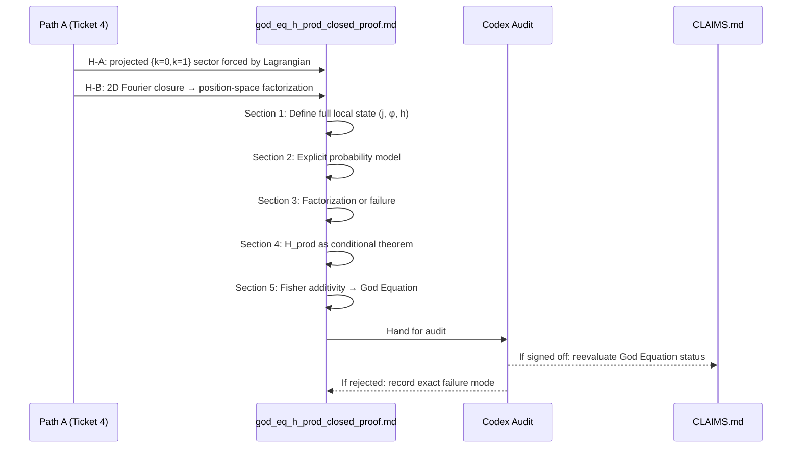

This handoff plan was updated after the 2026-04-01 chiral audit. Use it together with `CLAIMS.md` and `ACTIVE_ISSUES.md`; if this plan drifts from the live owner docs, the owner docs win. Do not assume the older `b=0` target is still valid.

## Observations

The ticket targets `H_prod` — the statistical independence factorization that is the final probability bridge for the God Equation. The derivation landscape is well-mapped:

- **Gap B** is closed negatively: the symmetric nearest-neighbor ℤ₃ operator does NOT yield diagonal 3-step closure
- **Path A** (chirality → `b=0`) was reframed on 2026-04-01: chiral projection does NOT eliminate the S̄² term in position space; the new obligations are (1) force P_L from the Lagrangian, and (2) determine whether 2D Fourier closure → position-space H_prod factorization
- The ticket's stated dependency on "Ticket 4 giving `b=0`" is therefore **stale** — Path A's current state is two open obligations, not a closed result

## Approach

The ticket asks for a formal derivation file `derivations/god_eq_h_prod_closed_proof.md` that addresses the three Codex-identified proof obligations. Given that Path A is not yet closed, the plan must (a) acknowledge the dependency honestly, (b) draft the proof structure that will close once Path A resolves, and (c) address the three obligations as far as they can be taken independently of Path A's outcome.

---

## Implementation Plan

### Step 1 — Audit the current dependency state before writing anything

Read the following files in sequence to establish the exact current state of Path A and what it has and has not delivered:

- `file:God_Equation_Path_A_—_Derive_b=0_from_chiral_ℤ₃_coupling_to_close_H_prod.md` (the 2026-04-01 reframe)
- `file:derivations/god_eq_gap_B_nearest_neighbor_no_go.md` (the Gap B no-go theorem)
- `file:derivations/h_prod_markovian_walk_proof.md` (the prior failed attempt and its exact rejection points)
- `file:sandbox/chiral_projection_z3.py` (the audited script showing `|β/α| = 1.0`)

This step is mandatory before writing. The ticket's stated dependency (`b=0` from Ticket 4) is stale as of 2026-04-01. The new file must not assume `b=0` is available.

---

### Step 2 — Write `derivations/god_eq_h_prod_closed_proof.md`

Create the file with the following structure. Each section maps to one of the three Codex proof obligations.

#### Section 0 — Header and honest status

State clearly:
- This file is a **conditional proof draft** — it proves H_prod under named hypotheses, not unconditionally
- The named hypotheses are: (H-A) Path A Obligation 1 is resolved (P_L is forced by the Lagrangian), and (H-B) Path A Obligation 2 is resolved affirmatively (2D Fourier closure → position-space factorization)
- If either hypothesis fails, this file records the exact failure mode
- Current status: `CONDITIONAL DRAFT — awaiting Path A audit`

#### Section 1 — Define the full local state (Proof Obligation 1)

This section must go beyond the coarse walk state. Specifically:

**1a. State space definition**

The full local state of the ℤ₃ walk is the triple `(j, φ, h)` where:
- `j ∈ ℤ₃` is the generation channel label (the coarse walk state)
- `φ ∈ [0, 2π)` is the internal phase within the channel (the hidden variable that the prior attempt ignored)
- `h ∈ {L, R}` is the chirality label (left/right-handed coupling)

The prior attempt (`h_prod_markovian_walk_proof.md`) only tracked `j`. Codex's objection was that local systems can carry memory through hidden variables — `φ` and `h` are those hidden variables.

**1b. Reduced-state dynamics after the chiral audit**

Under the chiral ℤ₃ Lagrangian (`z3_extended_propagation_lagrangian.md`), the current honest Path A hypothesis is **not** that chirality forces `T_L = α S̄`.

The audited script `sandbox/chiral_projection_z3.py` now establishes the weaker exact fact:

- the projected operator kills the `k=2` Fourier eigenmode
- the position-space operator still contains both `S̄` and `S̄²`
- numerically, `|β/α| = 1`, so the projected operator is **not** a pure shift

Therefore this section must **not** claim first-order Markovity of the coarse walk from chirality alone.

What can be stated conditionally is narrower:

- if H-A holds, the physically relevant state may reduce to the projected `{k=0,k=1}` sector
- if an explicit reduced-state update law exists on that sector, it must be written in that sector's own variables, not smuggled in as `T_L = α S̄`
- the remaining bridge is then whether closure in that projected Fourier sector implies the position-space factorization required for `H_prod`

State this as a bounded setup lemma, not a closure lemma:
**Lemma M'** — Under H-A, the God Equation route may be reformulated on the projected `{k=0,k=1}` sector, but first-order Markovity of the coarse walk `j` is not yet derived and must not be assumed.

#### Section 2 — Define the joint probability model honestly (Proof Obligation 2)

This is the section that the prior attempt left entirely unspecified. The model must be stated before factorization is proved.

**2a. Two candidate model classes**

The file should explicitly separate two different probability-model choices:

- **Model A — projected-sector observables**: define observables on the projected `{k=0,k=1}` sector, then ask whether their closure law descends to the position-space statement needed for `H_prod`
- **Model B — actual closure-object observables**: define observables directly on the actual non-diagonal closure operator and test factorization there

These are not the same theorem target. The file must pick one and state why.

**2b. If a replicated product experiment is used**

It must be labeled as a **candidate auxiliary model**, not as automatic closure of `H_prod`.

Why: if the three channel observables are defined as three independent experimental copies by construction, the factorization may become a property of the experimental setup rather than a theorem about the single-system God Equation closure object.

So if the replicated model is introduced, the file must answer:

- why this is the physically correct reading of the `H_prod` observables
- why it is not just building independence into the definition
- how it maps back to the actual closure object used in the God Equation route

**2c. Basis discipline**

The file must state explicitly whether each observable lives in:

- the projected Fourier sector, or
- the 3D position-space basis

because the current live gap is exactly the bridge between those two descriptions.

#### Section 3 — Prove or fail factorization (Proof Obligation 3)

**3a. Do not use product construction as a substitute for the theorem**

The file must not claim `H_prod` is proved merely because a product probability space was chosen.

What must be shown is one of:

- the actual `H_prod` observables are correctly represented by a product experiment model, or
- factorization holds on the actual single-system closure object without that shortcut

Otherwise the file only relocates the hidden step.

**3b. Channel marginals**

Any closure probability statement must be derived from the chosen closure object actually used in the file.

Do **not** write:

- `T_L = α S̄`
- `T_L³ = α³ I`

unless that exact operator has first been derived in the chosen basis. After the 2026-04-01 audit, those equalities are not available from chirality alone.

**3c. Fourier basis vs position basis**

If factorization is shown in the projected Fourier sector, the file must then state separately whether that result:

- descends to the position-space basis needed by `H_prod`, or
- stops in the Fourier sector and therefore does not close the theorem

**3d. Honest outcome branch**

This section is allowed to end in either result:

- a conditional factorization theorem with exact hypotheses, or
- a recorded failure mode showing that the chosen probability model does not reach position-space `H_prod`

#### Section 4 — State H_prod as a theorem

State the theorem with its exact conditional scope:

**Theorem H_prod** (conditional scope statement): Under the chiral ℤ₃ Lagrangian with projected-sector forcing (H-A) and with projected-sector closure propagating to the position-space factorization required by `H_prod` (H-B), the joint law of the relevant closure observables factorizes.

The exact observable definition and marginals must match the chosen model in Sections 2–3.
Do not hard-code `p_j = α³` unless that exact kernel has been derived.

#### Section 5 — Close the God Equation (conditional)

Once H_prod is accepted, cite the Fisher additivity chain from `file:derivations/god_eq_cascade_coupling_operator_prep.md`:

- Equal channel marginals → `G^(a)(θ) = g(θ)` for all `a` (from the explicit closure probabilities derived in Sections 2–3)
- Fisher additivity (from H_prod + product family structure): `G(θ) = 3g(θ)`
- Determinant scaling: `√det G = 3^{D/2} √det g = N^{D/2} √det g`
- God Equation: `λ_c = √2 · l_P · exp(4π²N^{D/2}/b₀)`

State explicitly: this chain closes **if and only if** H-A and H-B are both confirmed by Codex audit of Path A.

#### Section 6 — Failure modes and what would kill this proof

Document the exact failure modes:

| Failure | Condition | Consequence |
|---------|-----------|-------------|
| H-A fails | The projected `{k=0,k=1}` sector is not forced by the Lagrangian | Path A cannot start on the projected-sector route |
| H-B fails | 2D Fourier closure does not propagate to position-space H_prod | Section 3 gives only Fourier-basis independence, not position-space factorization; H_prod fails |
| Product experiment model rejected | Codex rules the three walks are not independent experiments | Factorization is not by construction; need a different probability model |
| Closure probabilities not derived from the chosen model | The file uses pure-shift or `α³` language without deriving that kernel | Equal marginals / Fisher additivity chain are unsupported |

---

### Step 3 — Update `CLAIMS.md` header note (do not change the score)

Add a note to the God Equation row in `file:CLAIMS.md` referencing the new file:

> `god_eq_h_prod_closed_proof.md` contains a conditional proof draft of H_prod under Path A hypotheses H-A and H-B. Status remains CONDITIONAL 0.88 until Codex audits Path A Obligations 1 and 2.

Do **not** change the confidence score. The score changes only after Codex sign-off.

---

### Step 4 — Hand to Codex for audit

The file's acceptance criteria (from the ticket) map to the following audit targets:

| Criterion | Where addressed in the file |
|-----------|----------------------------|
| Full local state defined | Section 1a — triple `(j, φ, h)` |
| Honest reduced-state setup after chiral audit | Section 1b — Lemma M', conditional on H-A |
| Joint probability model explicitly constructed | Section 2 — chosen model class and basis |
| Factorization proof does not use "zero covariance = independence" | Section 3 — explicit factorization or explicit failure |
| H_prod stated as theorem | Section 4 |
| God Equation chain cited | Section 5 |

Codex's audit should focus on:
1. Whether the chosen probability model matches the actual `H_prod` observables rather than defining independence by setup
2. Whether Lemma M' is stated honestly after the 2026-04-01 chiral audit
3. Whether any factorization result reaches the position-space basis that `H_prod` actually needs
4. Whether the file still smuggles in the dead pure-shift shortcut under new labels

---

### Dependency diagram

