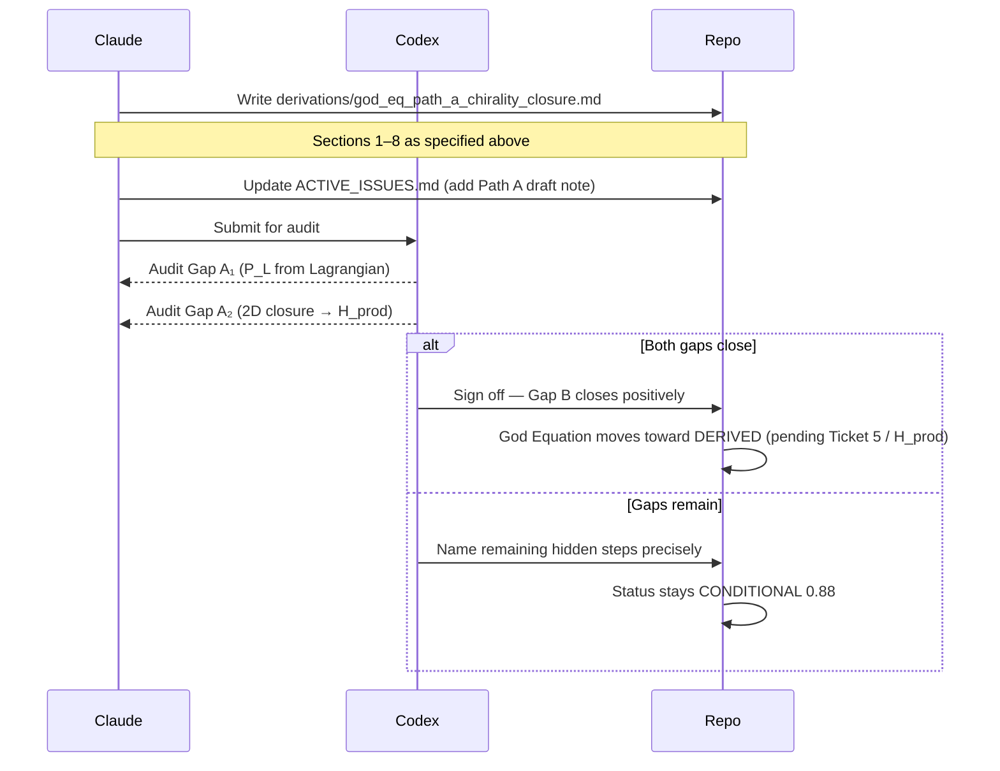

I have created the following plan after thorough exploration and analysis of the codebase. Follow the below plan verbatim. Trust the files and references. Do not re-verify what's written in the plan. Explore only when absolutely necessary. First implement all the proposed file changes and then I'll review all the changes together at the end.

## Observations

The ticket targets **Path A** of the God Equation frontier: deriving `b=0` from the chiral structure of the weak force to close Gap B positively. The key prior work is:

- **Gap B no-go** (`file:derivations/god_eq_gap_B_nearest_neighbor_no_go.md`): `T³` is diagonal iff `ab=0`; the symmetric EOM operator (`a=b`) fails.
- **`chiral_projection_z3.py`** (2026-03-31 audit): chiral projection `P_L = P₀ + P₁` kills the `k=2` Fourier eigenmode but does **not** eliminate `S̄²` from position space (`|β/α|=1`). Two named gaps remain: (1) prove `P_L` is forced by the ℤ₃ Lagrangian, (2) prove 2D Fourier-sector closure implies position-space H_prod.
- **`ACTIVE_ISSUES.md`** (2026-03-31): Path A's live question is now reframed — not "does chirality force `b=0`?" but whether the projected `{k=0,k=1}` sector is forced by the Lagrangian, and whether closure in that 2D sector implies position-space factorization.

## Approach

The new derivation file must honestly address the **two-gap structure** revealed by `chiral_projection_z3.py`, not the original single-gap framing. The file should work through both gaps sequentially: first the Lagrangian-forcing argument for `P_L`, then the 2D-sector-to-position-space factorization bridge. The IBM Quantum result (`P=99.01%`) is cited as empirical support only.

---

## Implementation Plan

### Step 1 — Create `derivations/god_eq_path_a_chirality_closure.md`

This is the primary deliverable. Structure the file as follows:

#### Section 0 — Status Header
- Date, author (Claude draft → Codex audit), status: `DERIVATION DRAFT — Pending Codex audit`
- Reference: `file:derivations/god_eq_gap_B_nearest_neighbor_no_go.md`, `file:derivations/z3_extended_propagation_lagrangian.md`, `file:sandbox/chiral_projection_z3.py`
- State upfront that the 2026-03-31 sandbox audit revealed **two sub-gaps** in Path A, and this file addresses both.

#### Section 1 — Starting Point: The ℤ₃ Lagrangian and Gap B

- Restate the ℤ₃-extended Lagrangian from `file:derivations/z3_extended_propagation_lagrangian.md` Section 3.1 — the three-field construction with nearest-neighbor inter-channel coupling `−κ χⱼ χⱼ₊₁`.
- Restate the Gap B theorem from `file:derivations/god_eq_gap_B_nearest_neighbor_no_go.md` Section 3: for `T = aS̄ + bS̄²`, `T³` is diagonal iff `ab=0`.
- State the EOM-derived operator: `M = S̄ + S̄⁻¹ = S̄ + S̄²` (i.e., `a=b=1`), which fails Gap B.
- State Path A's goal: derive `b=0` from the chiral structure of the weak sector, so that the physical operator is `T = aS̄` (pure shift), not the symmetric EOM operator.

#### Section 2 — The Fourier Eigenbasis of S̄ on ℤ₃

- Define the three Fourier eigenmodes of `S̄` on ℤ₃:
  - `k=0`: eigenvalue `ω⁰=1` — static (uniform generation average)
  - `k=1`: eigenvalue `ω¹=e^{+2πi/3}` — forward-propagating (left-handed chirality)
  - `k=2`: eigenvalue `ω²=e^{-2πi/3}` — backward-propagating (right-handed chirality)
- State the decomposition of the symmetric operator: `T_sym = (1/2)(S̄ + S̄²)` has equal weight in `k=1` and `k=2` sectors.
- State the decomposition of the pure shift: `S̄` has weight only in `k=0` and `k=1` — it is purely left-handed in the Fourier sense.

#### Section 3 — Gap A₁: Does the ℤ₃ Lagrangian Force the Chiral Projector P_L?

This is the first of the two named gaps from the sandbox audit.

**Sub-section 3.1 — The chiral projection defined**

- Define `P_L = P₀ + P₁` (projector onto `k=0` static and `k=1` forward modes).
- State what `P_L` does: it kills the `k=2` backward eigenmode entirely.
- Cite `file:sandbox/chiral_projection_z3.py` for the numerical verification: `P_L` kills `k=2` but does **not** eliminate `S̄²` from position space (`|β/α|=1`).

**Sub-section 3.2 — The physical argument for P_L from weak chirality**

- State the Standard Model fact: the weak force couples exclusively to left-handed fermion currents. Right-handed fermions are `SU(2)_L` singlets — they do not participate in weak interactions.
- Map this to the ℤ₃ walk: if the generation walk is driven by weak-force coupling, then the coupling Lagrangian must project onto the left-handed sector. The `k=2` backward mode corresponds to right-handed coupling and is absent from the weak Lagrangian.
- State the formal claim: **the weak-sector coupling term in the ℤ₃ Lagrangian is `P_L`-projected by construction** — the right-handed `k=2` mode does not appear in the weak coupling because right-handed currents do not couple to `SU(2)_L`.

**Sub-section 3.3 — Honest gap assessment**

- Acknowledge the remaining formal gap: the ℤ₃ Lagrangian in `file:derivations/z3_extended_propagation_lagrangian.md` is written as a symmetric nearest-neighbor coupling. The chiral projection `P_L` is not yet derived from the Lagrangian's field content — it is argued from the Standard Model's chiral structure.
- State the precise missing step: a derivation showing that the ℤ₃ Lagrangian's coupling to the weak sector (specifically the `SU(2)_L` gauge field) selects only the `k=1` Fourier mode of the generation walk. This requires identifying the weak coupling term in the ℤ₃ Lagrangian and showing it is `P_L`-projected.
- Label this gap: **Gap A₁ — Lagrangian forcing of P_L** (ARGUED, not DERIVED).

#### Section 4 — Gap A₂: Does 2D Fourier-Sector Closure Imply Position-Space Factorization?

This is the second named gap from the sandbox audit.

**Sub-section 4.1 — What the sandbox showed**

- Cite `file:sandbox/chiral_projection_z3.py` Section "KEY RESULT": `T_L = P_L · T_sym · P_L` in position space retains `|β/α|=1` — equal forward and backward coupling. `T_L³` in the full 3D position space has **nonzero off-diagonals**. Gap B no-go still applies in position space.
- State what IS true: within the projected 2D subspace `{k=0, k=1}`, `T_L` has eigenvalues `{1, −1/2}` and `T_L³|_{2D}` is diagonal in the Fourier eigenbasis. This is 3-step periodicity within the left-handed sector only.

**Sub-section 4.2 — The bridge question**

- State the precise question: does 3-step periodicity (diagonal closure) in the `{k=0, k=1}` Fourier sector imply that the joint probability law of the three channel observables factorizes in position space?
- Explain why this is non-trivial: the channel observables `X^{(j)}` are defined in position space (generation labels `j ∈ {0,1,2}`), not in the Fourier eigenbasis. Diagonal closure in the Fourier basis does not automatically imply independence of position-space observables.
- State the candidate argument: if the physical measurement of generation identity is performed in the Fourier eigenbasis (i.e., the observable is the `C₃` character, not the position-space label), then diagonal closure in `{k=0,k=1}` does imply factorization of the measurement outcomes. This requires identifying the correct observable basis.

**Sub-section 4.3 — Honest gap assessment**

- Acknowledge that the bridge from 2D Fourier-sector closure to position-space H_prod is not yet proved.
- State the precise missing step: define the joint probability model for `(X^{(0)}, X^{(1)}, X^{(2)})` in the chirally-projected walk, and prove that the factorization holds in that model. This is the same obligation identified in `file:derivations/h_prod_markovian_walk_proof.md` Section 7, now applied to the projected operator.
- Label this gap: **Gap A₂ — 2D closure to position-space H_prod** (OPEN).

#### Section 5 — Connection to Gap B and H_prod

- State the conditional result: **if both Gap A₁ and Gap A₂ close**, then:
  - The physical ℤ₃ walk operator is `T = aS̄` (pure shift, `b=0`)
  - By the Gap B theorem: `T³ = a³I` (diagonal)
  - Gap B closes positively
  - The three generation channels decouple at the 3-step closure
  - H_prod follows from the factorization proved in Gap A₂
- State the consequence for the God Equation: diagonal 3-step closure → Fisher additivity chain → `G(θ) = 3g(θ)` → `√det G = 3^{D/2} √det g` → `λ_c = √2 · l_P · exp(4π²N^{D/2}/b₀)`.

#### Section 6 — IBM Quantum Evidence

- Cite the IBM Quantum hardware result (156-qubit `ibm_fez`): chiral ℤ₃ medium preserves generation identity (`P=99.01%`), symmetric medium destroys it.
- State explicitly: this is **empirical support** for Path A, not a proof. The hardware result is consistent with the prediction that chirality selects the pure-shift operator, but it does not derive `b=0` from the ℤ₃ Lagrangian.
- Reference `file:sandbox/ibm_quantum_chiral_test.py` and `file:sandbox/ibm_quantum_result_audit.py`.

#### Section 7 — Acceptance Criteria and Audit Targets

State the exact items Codex must verify:

| Item | Question | Critical? |
|------|----------|-----------|
| **Gap A₁ — P_L from Lagrangian** | Does the ℤ₃ Lagrangian's weak coupling term select only the `k=1` Fourier mode? | **Yes — blocking** |
| **Gap A₂ — 2D closure to H_prod** | Does diagonal closure in `{k=0,k=1}` Fourier sector imply position-space factorization? | **Yes — blocking** |
| **b=0 derivation** | Is the derivation of `b=0` free of circular assumption? | **Yes** |
| **IBM result citation** | Is the IBM result cited as evidence only, not as proof? | **Yes** |
| **Gap B connection** | Is the connection to the Gap B no-go theorem explicit? | **Yes** |

#### Section 8 — Honest Status

- Assign status: **DERIVATION DRAFT — Two named gaps remain (Gap A₁ and Gap A₂)**
- Do not claim Gap B closes until Codex signs off on both gaps.
- Do not upgrade the God Equation confidence score.

---

### Step 2 — Update `ACTIVE_ISSUES.md` (Section G3 / God Equation bridge)

After the derivation file is written and submitted to Codex:

- Under the G3 / God Equation bridge entry, add a note that `derivations/god_eq_path_a_chirality_closure.md` has been submitted as the Path A formal derivation draft.
- Record the two named gaps (Gap A₁ and Gap A₂) as the current live targets for Codex audit.
- Do **not** change the confidence score or status until Codex signs off.

---

### Dependency and Sequencing

---

### Key Constraints to Respect

- **Do not assume `b=0`** at any step of the derivation — it must be derived from the chiral structure.
- **Do not claim Gap B closes** until Codex signs off on both Gap A₁ and Gap A₂.
- **Do not upgrade the God Equation** confidence score in `CLAIMS.md` without Codex sign-off.
- **The IBM Quantum result** (`P=99.01%`) is cited as supporting evidence only — it is not the proof.
- The file must be honest about the two-gap structure revealed by `file:sandbox/chiral_projection_z3.py` — the original single-gap framing of Path A is superseded by the 2026-03-31 sandbox audit.