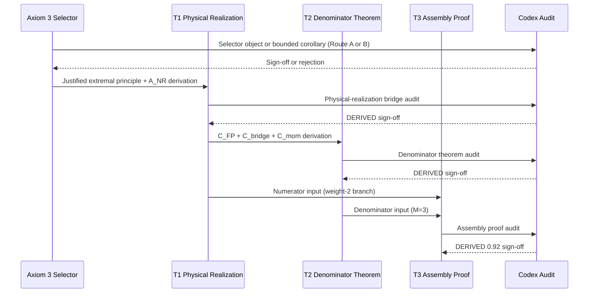

I have created the following plan after thorough exploration and analysis of the codebase. Follow the below plan verbatim. Trust the files and references. Do not re-verify what's written in the plan. Explore only when absolutely necessary. First implement all the proposed file changes and then I'll review all the changes together at the end.

## Observations

T3 is a **conditional assembly ticket** — the algebra `2N/(2N+3) = 2/3 → N=3` is already exact and documented in `file:derivations/three_generations_t2_proof.md`. The blocker is that both upstream theorems remain `PARTIAL DERIVATION 0.85` after the 2026-03-31 Codex audits. T1's live gap is the Axiom 3 extremal principle + `A_NR` non-redundancy hypothesis. T2's live gaps are `C_FP`, `C_bridge`, `C_mom`, and `C_gen`. The `file:derivations/axiom3_selector_note_2026-04-01.md` identifies the selector problem as the upstream blocker for T1, which must be resolved before T2 can close.

## Approach

The plan follows the clean upstream-to-downstream sequence mandated by `file:derivations/axiom3_selector_note_2026-04-01.md` and `file:derivations/generation_closure_cards_2026-04-01.md`: selector work → T1 closure → T2 closure → T3 assembly. Each step is a bounded, auditable deliverable. No step claims more than what the named gaps require.

---

## Step 1 — Write the Axiom 3 Selector Object (upstream blocker for T1)

**New file**: `derivations/axiom3_selector_derivation.md`

Following the four-piece structure mandated by `file:derivations/axiom3_selector_note_2026-04-01.md` Section 4:

- **Domain**: Specify the named family of PF-admissible candidates — the two closure-order sectors `s ∈ {1,2}` from `π₁(SO(3)) ≅ ℤ₂`, with fixed conserved labels and stated topology.
- **Ordering object**: Attempt Route A (derived selector functional) first. The candidate is `F_C = I(Φ_int; Φ_ext)` from `file:derivations/casimir_axiom3_functional_candidate_C.md`. Derive why this functional is PF-native — i.e., why Axiom 3's coherence requirement maps to mutual information maximization rather than merely permitting it. If Route A fails the acceptance tests, fall back to Route B: a bounded corollary in the style of Axiom 3b, scoped explicitly to the `(1,2)` closure-order family.
- **Classification rule**: State what happens to the weight-1-only configuration — whether it is forbidden, metastable, or merely lower-scoring — and under what conditions.
- **Falsifier**: Name a concrete condition that would break the selector (e.g., a stable weight-1-only PF model with no coherence deficit despite an available weight-2 branch).

Run all five acceptance tests from `file:derivations/axiom3_selector_note_2026-04-01.md` Section 5 against the proposed selector before submitting for audit. Especially Test 2 (threshold vs. selection) and Test 3 (Family C justification).

**Submit to Codex for audit** before proceeding to Step 2.

---

## Step 2 — Close T1: Derive the Extremal Principle and `A_NR`

**Update file**: `file:derivations/t1_physical_realization_theorem.md`

Using the signed-off selector from Step 1, close the two remaining T1 gaps identified in `file:derivations/t1_physical_realization_theorem_audit_2026-03-31.md`:

- **Gap T1-A (Extremal Principle Bridge)**: Replace the current "candidate language" framing with a derived statement: show that the signed-off selector functional from Step 1 is the correct Axiom 3 ordering object for the `(1,2)` closure-order family. This upgrades `F_C = I(Φ_int; Φ_ext)` from candidate to accepted.
- **Gap T1-B (`A_NR` derivation)**: Derive the conditional non-redundancy hypothesis `I(Φ_int^(2); Φ_ext^(2) | Φ_int^(1), Φ_ext^(1)) > 0` from the topological distinctness of the two loop classes in `SO(3)` plus the signed-off selector. The argument must show that the nontrivial loop class carries phase information not already fixed by the contractible class — without smuggling in QFT spinors or the spin-statistics theorem.
- **Gap T1-C (Branch classification)**: Classify whether a weight-1-only configuration is forbidden, metastable, or lower-scoring under the derived selector. This closes the open classification item from `file:derivations/generation_closure_cards_2026-04-01.md` Card T1.

The `SU(2)` lift step (Proof Obligation 3 in the current file) already survives audit — do not re-litigate it.

**Submit to Codex for audit**. Target verdict: T1 upgrades from `PARTIAL DERIVATION 0.85` → `DERIVED`.

---

## Step 3 — Close T2: Derive the PF-Native Denominator Bridges

**Update files**: `file:derivations/t2_denominator_theorem.md`, `file:derivations/t2_fermi_point_bridge.md`, `file:derivations/t2_order_parameter_derivation.md`

Using T1's now-derived `ℂ²` state space, close the four named T2 gaps from `file:derivations/generation_closure_cards_2026-04-01.md` Card T2:

- **`C_mom` (Translation invariance)**: Derive or explicitly adopt as a bounded corollary that the PF weight-2 sector admits a translation-invariant momentum-space description. State the scope explicitly — this is a named conditional, not a hidden assumption.
- **`C_FP` (Fermi point existence)**: Derive that the PF weight-2 propagation sector has band-touching points in 3D momentum space. The argument must flow from T1's `ℂ²` structure + Axiom 2's real-energy requirement + `C_mom`, without importing condensed-matter band structure.
- **`C_bridge` (Restoration-mode identification)**: Prove from PF axioms alone that each of the three gap-opening Pauli directions at a Fermi point is an independent massive bosonic restoration mode of the PF coherence field. The current `file:derivations/t2_fermi_point_bridge.md` Part B names this as `C_bridge` and provides the Volovik template argument (ARGUED 0.72). The target is to replace the Volovik analogy with a PF-native dynamics argument — either via the formal `G→H` symmetry chain in `t2_order_parameter_derivation.md` Section 4.5, or via a direct PF coherence-field fluctuation spectrum argument.
- **`C_gen` (Jacobian genericity)**: Verify that the Jacobian `Dh(k_F)` is nonsingular at the actual PF Fermi point, or argue why the PF Hamiltonian is generic enough for the implicit function theorem to apply.

Keep `d = 3` as an explicit named input throughout — do not attempt to derive spatial dimensionality from PF axioms in this ticket.

**Submit to Codex for audit**. Target verdict: T2 upgrades from `PARTIAL DERIVATION 0.85` → `DERIVED`.

---

## Step 4 — Write the T3 Assembly Proof

**New file**: `derivations/three_generations_closed_proof.md`

This is the clean, auditable assembly proof mandated by the T3 ticket. Structure it as follows:

1. **Preamble**: State that this file is the T3 assembly step, conditional on T1 and T2 having reached DERIVED status. Cite the Codex sign-off dates and audit file references for both.

2. **Theorem statement**: "In a 3D PF medium satisfying Axioms 1–3, the number of fermion generations is exactly 3."

3. **Inputs (cite explicitly)**:
   - T1 (DERIVED): PF-stable modes realize closure weights `(2,1)` → numerator of `Q(N) = 2N/(2N+M)` is `2N`
   - T2 (DERIVED): `M = 3` from co-dimension of point defect in 3D PF medium → denominator is `3`
   - Koide `Q = 2/3` (DERIVED 0.95): geometric theorem, independent of T1/T2

4. **Algebra**: Execute the unique positive integer solution — `2N/(2N+3) = 2/3 → 4N+6 = 6N → N = 3`. This algebra is already written in `file:derivations/three_generations_t2_proof.md` Section 1 and can be cited directly.

5. **Uniqueness**: State that `N = 3` is the unique positive integer solution.

6. **Honest scope**: State what the theorem does and does not claim — it does not derive spatial dimensionality, does not derive the full fermion/boson distinction, and does not derive spin-statistics.

**Submit to Codex for audit** to confirm no new hidden steps were introduced in the assembly.

---

## Step 5 — Update All Dependent Files

Once Codex signs off on the T3 assembly proof, update the following files to resolve the split-brain inconsistency documented in `file:derivations/three_generations_t2_audit_2026-03-28.md`:

| File | Update Required |
|------|----------------|
| `file:CLAIMS.md` | Update "Three Generations" row: `CONDITIONAL 0.85` → `DERIVED 0.92`. Cite T3 assembly proof and Codex sign-off date. |
| `file:papers/FALSIFICATION_PAPER_DRAFT.md` | Sync Section 3.2 and the honesty table to agree on T2/T3 status. Remove the split-brain inconsistency (Section 3.2 said DERIVED while the honesty table said PARTIAL DERIVATION). |
| `file:AGENTS.md` | Update Part II "The Five Core Results" — Three Generations entry: change status from `CONDITIONAL 0.85` to `DERIVED 0.92`. Update the confidence score and cite the closed proof. |
| `file:derivations/t1_t2_post_audit_epic_2026-03-31.md` | Add a closing note that T1, T2, and T3 have all reached DERIVED status, with dates and audit references. |
| `file:derivations/generation_closure_cards_2026-04-01.md` | Update Card T1 and Card T2 live status fields to DERIVED. Add a T3 card showing the assembly as closed. |

Do **not** update `CLAIMS.md` before Codex signs off on the assembly proof — the truth order in `file:AGENTS.md` Part IV requires Codex sign-off before any upgrade.