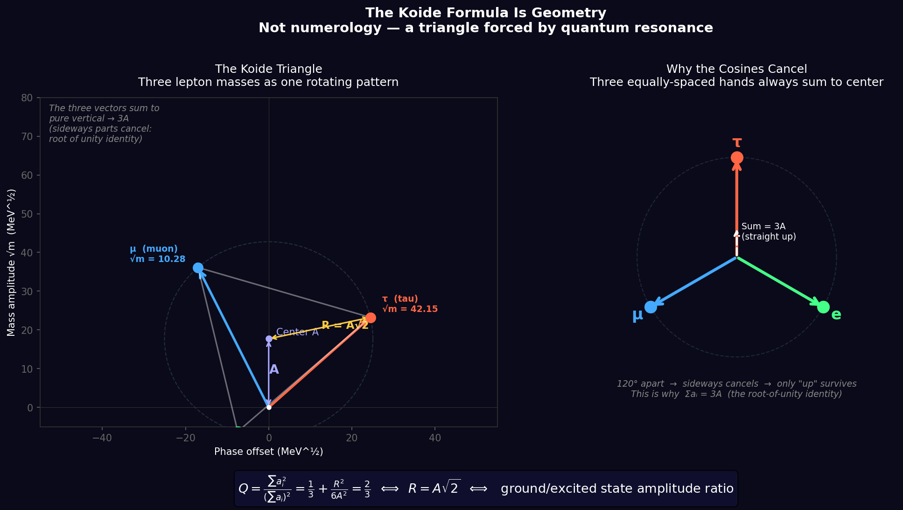

# The Propagation Framework

*A first-principles research framework built around one claim: propagation is fundamental.*
*Developed by Greg Welby with AI collaborators Claude, Lumi, Codex, and Qwen - March 2026*

---

## 🌟 Start Here

If you are new to the Propagation Framework, **do not start by reading the technical files in this repository.**

Instead, start by experiencing the framework:
👉 **[Open the Interactive Explorer (Start Here)](./sandbox/explorer/index.html)**

The Explorer is the public gateway. It starts with the mysteries of reality and shows you the patterns visually before diving into the math.

---

## What This Repository Is

This repository documents the Propagation Framework: a research program that treats space not as
an empty mathematical void, but as a physical medium through which information propagates.

The framework is not presented here as a finished theory with every gap closed. Some results are
derived, some are argued, some are empirical, and some remain open. The live status of every major
claim is tracked in [CLAIMS.md](./CLAIMS.md).
Public-facing summaries in this repo should defer to that file rather than create a second formal
scoreboard.

At the center of the framework are three axioms:

1. **Propagation is fundamental**
2. **Every medium has a causal velocity**
3. **Coherence is necessary for stable structure**

The canonical statement of those axioms is in
[the_propagation_framework.md](./the_propagation_framework.md).

---

## Core Picture

In the Propagation Framework:

- **Matter** is modeled as a stable, self-reinforcing propagation pattern
- **Energy** is frequency
- **Forces** are approached as path-bending or mode-changing effects of the medium; the exact
  closed theorem today is gravity as optical geometry in its null/static-stationary domain
- **Stable structure** exists only where coherence is maintained

This repo asks what follows from those claims mathematically, and what survives contact with real
data.

---

## Current Headline Results

| Result | Status | Confidence |
|--------|--------|------------|
| Topological weights (2,1) from π₁(SO(3)) | PARTIAL DERIVATION | 0.85 |
| Three generations of matter | CONDITIONAL | 0.85 |
| Koide geometry: \(Q = 2/3 \iff R/A = \sqrt{2}\) | DERIVED | 0.95 |
| Gravity as optical geometry / refraction (null/static-stationary) | DERIVED | 0.95 |
| 8-hour sleep constant from (2,1) ratio | ARGUED | 0.72 |
| Weinberg angle: \(\sin^2\theta_W \approx 0.22310\) via Axiom 3b | ARGUED | 0.65 |
| QCD confinement from λ_c via RG running | ARGUED | 0.72 |
| Matter scale from Planck scale (God Equation) | CONDITIONAL 0.88 / ARGUED 0.60 | see CLAIMS.md |
| Top/tau mass ratio \(\approx \alpha^{-1}/\sqrt{2}\) | EMPIRICAL | 0.90 |

The exact status definitions and falsification pathways are in [CLAIMS.md](./CLAIMS.md).

---

## The God Equation

The matter-coherence-scale program is currently split, not DERIVED. The
Postulate-D Z3 operator algebra is a real conditional result, while the scale
formula remains argued because Postulate D, `N^(D/2)`, and `H_prod` are not
derived from Axioms 1-3. The underlying formula is:

\[
\lambda_c = \sqrt{2} \cdot l_P \cdot \exp\!\left(\frac{4\pi^2 N^{D/2}}{b_0^{SO(3)}}\right).
\]

With \(N=3\), \(D=3\), and \(b_0 = 16/3\):

- **Predicted**: \(1.157 \times 10^{-18}\,\mathrm{m}\)
- **Observed**: \(1.14 \times 10^{-18}\,\mathrm{m}\)
- **Error**: \(1.48\%\)
- **Parameter boundary**: no tunable numerical knob after \(N\), \(D\), and
  \(b_0\) are chosen, but \(N\), \(D\), and the \(N^{D/2}\) bridge are still
  premise-bearing
- **Status**: Postulate-D operator algebra **CONDITIONAL 0.88**; lambda scale
  formula **ARGUED 0.60**

What is closed:

- the numeric endpoint
- the chiral-vs-symmetric selection evidence
- the numerical agreement of the final scale

What is still open:

- the bridge from internal phase closure to the required spatial coherence-volume scaling
  \(N^{D/2}\)
- the primitive operator / closure step on the actual derived \(\mathbb{Z}_3\) structure
  (`G3-OP-MAP`; trace-norm and Perron-Frobenius routes are now closed as conditional negatives)
- a theorem-grade proof of `H_prod` rather than covariance-only support

See [derivations/lambda_c_from_axioms.md](./derivations/lambda_c_from_axioms.md),
[derivations/g3_coupling_bridge.md](./derivations/g3_coupling_bridge.md),
[derivations/product_walk_bridge_model.md](./derivations/product_walk_bridge_model.md), and
[CLAIMS.md](./CLAIMS.md).

You can run the numerical verification directly:

```bash
python RESEARCH/god_equation_verification.py
```

---

## The Koide Result

The cleanest finished result in the repo is the geometric form of the Koide relation for charged
leptons:

\[
Q = \frac{m_e + m_\mu + m_\tau}{(\sqrt{m_e} + \sqrt{m_\mu} + \sqrt{m_\tau})^2}
= \frac{2}{3}
\iff
\frac{R}{A} = \sqrt{2}
\iff
\theta = 45^\circ.
\]

The geometric equivalence is exact, and the PDG 2024 charged-lepton data verify it to high
precision. The deeper question of why the equal-norm point is selected remains open.



*Three lepton mass square roots forming a perfect equilateral triangle in amplitude space. Not constructed — measured from PDG particle masses. R/A = √2 holds to 6 decimal places.*

See [derivations/koide_geometric_equivalence.md](./derivations/koide_geometric_equivalence.md).

You can regenerate the triangle directly:

```bash
python visualizations/koide_triangle.py
```

---

## What Failed

This repo keeps failures visible.

- The corrected \(\phi^3\) electron/up-quark relation is interesting but remains uncertainty-limited
  and a posteriori. See [sandbox/phi3_monte_carlo.md](./sandbox/phi3_monte_carlo.md).
- The harmonic-series mass claim failed. See [sandbox/sandbox_results.md](./sandbox/sandbox_results.md).

A framework that only publishes successes is not science.

---

## Where To Start

- [EXPLAINER.md](./EXPLAINER.md): plain-English entry point
- [READING_ORDER.md](./READING_ORDER.md): guided path by background level
- [CLAIMS.md](./CLAIMS.md): live confidence matrix
- [CONTRIBUTING.md](./CONTRIBUTING.md): open gaps and how to engage
- [API_README.md](./API_README.md): Python API documentation

---

## Python API

The framework is now available as an importable Python module:

```python
from propagation import koide_q, god_equation, refractive_index_schwarzschild

# Koide formula from PDG masses
q = koide_q(0.511, 105.658, 1776.86)  # → 0.6666605... (≈ 2/3)

# Matter scale from Planck scale
lambda_c = god_equation(N=3, D=3, b0=16/3)  # → 1.15e-18 m

# Gravity as refraction
n = refractive_index_schwarzschild(r, M)  # → n(r) = 1 + GM/(rc²)
```

Run the demo:
```bash
python propagation.py
```

See [API_README.md](./API_README.md) for full documentation.

---

## Demonstrations

### Refractive Gravity

The orbital simulation shows gravity emerging from a refractive index gradient:

```bash
python sandbox/refractive_gravity_demo.py
```

Output:
- `sandbox/refractive_orbits.png` — Static visualization
- `sandbox/refractive_orbits.gif` — Animated simulation

The demo shows:
1. Light rays bending through the refractive gradient (geometric optics)
2. Matter in elliptical orbits (Newtonian limit)
3. **Both are modeled as path-bending in the same weak-field \(n(r)\) field**

---

## Repository Map

- [the_propagation_framework.md](./the_propagation_framework.md): canonical axioms and derived quantities
- [theory_of_propagation.md](./theory_of_propagation.md): supporting conceptual framework
- [derivations/](./derivations/): formal derivations and audits
- [sandbox/](./sandbox/): scripts, audits, and numerical experiments
- [visualizations/](./visualizations/): Koide triangle and knowledge graph
- [papers/](./papers/): draft paper material and falsification framing
- [RESEARCH/](./RESEARCH/): literature review passes and research notes

---

## Provenance

This repository was built as a human-AI collaboration. Greg Welby provided the core vision,
problem selection, synthesis, and final judgment. Claude, Lumi, Codex, and Qwen contributed
derivations, audits, counterexamples, literature synthesis, and runnable verification work.

The point of keeping those roles visible is traceability.

---

*This might be wrong. That's the point. The framework that survives contact with data is the one
worth keeping.*
