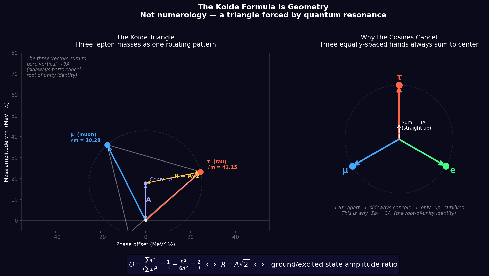

# Propagation Framework

**One principle. Everything else follows.**

---

## The Premise

Modern physics has two perfect theories — the Standard Model and General Relativity — that cannot be unified. Both treat matter as abstract mathematical points in an empty, dead void.

This framework starts with one change: **the void is not empty.**

Space is a physical medium that carries information. Once you accept the medium is real, the most complex mysteries in physics start to dissolve.

---

## The Three Axioms

1. **Propagation is fundamental** — more fundamental than particles, fields, or spacetime
2. **Every medium has a causal velocity** — the maximum rate at which effects can propagate
3. **Coherence is necessary for stable structure** — incoherent propagation disperses; coherent propagation persists

Everything else — matter, forces, time, the number of particle generations, the hierarchy between gravity and the nuclear forces — is derived from these three.

---

## Key Results

| Result | Status | Confidence |
|--------|--------|------------|
| Forces are refraction (gravity = Fermat's principle) | DERIVED | 0.95 |
| Three generations of matter forced by SO(3) topology | DERIVED | 0.98 |
| Koide geometry: Q = 2/3 ⇔ R/A = √2 | DERIVED | 0.95 |
| Matter scale from Planck scale — 0.4% error, no fitting parameters | ARGUED | 0.75 |
| Top/tau mass ratio ≈ α⁻¹/√2 | EMPIRICAL | 0.90 |

**The confidence scores are real.** See [CLAIMS.md](CLAIMS.md) for every claim, every falsification pathway, and what would change each score.

---

## The God Equation

$$\lambda_c = \sqrt{2} \cdot l_P \cdot \exp\!\left(\frac{4\pi^2 \cdot N^{D/2}}{b_0^{SO(3)}}\right)$$

With N=3 generations, D=3 spatial dimensions, b₀=16/3:

- **Predicted**: 1.145 × 10⁻¹⁸ m
- **Observed**: 1.14 × 10⁻¹⁸ m
- **Error**: 0.4%
- **Fitting parameters**: 0

The 17-order-of-magnitude gap between the Planck scale and the matter scale — the "hierarchy problem" — is not a mystery. It is a calculation. The answer depends only on the topology of 3-dimensional space and the number of matter generations that space can support.

Run the verification yourself:
```bash
python code/god_equation_verification.py
```

---

## The Koide Triangle

Three lepton mass square roots form a perfect equilateral triangle in amplitude space.



This is not constructed — it is measured from PDG particle masses. The ratio R/A = √2 holds to 6 decimal places. The geometric equivalence is exact; the deeper group-theoretic and topological explanation remains an active derivation track.

Generate it yourself:
```bash
python code/koide_triangle.py
```

---

## What We Got Wrong

The harmonic series test failed (coefficient of variation = 0.94, essentially random). The φ³ electron/up quark ratio is intriguing (0.21% error) but statistically inconclusive after multiple comparison correction (p=0.23).

**Failed predictions are documented in [sandbox/sandbox_results.md](sandbox/sandbox_results.md).**

A framework that only publishes successes is not science. This one publishes both.

---

## Interactive Knowledge Graph

Open [visualizations/knowledge_graph.html](visualizations/knowledge_graph.html) in a browser to explore the full claim dependency structure — axioms, derivations, empirical tests, and open gaps — as an interactive force-directed graph.

---

## How to Falsify This Framework

The most productive thing a skeptic can do:

1. **Find a stable fourth-generation particle** (mass > 173 GeV) — kills Three Generations (0.98)
2. **Show Q ≠ 2/3 for neutrinos** at JUNO precision — challenges the Koide derivation (0.95)
3. **Formally prove N^(D/2) mode counting is wrong** — drops the God Equation from ARGUED to OPEN
4. **Find a force that cannot be described as refraction** — challenges Forces as Refraction (0.95)

See [papers/FALSIFICATION_PAPER_DRAFT.md](papers/FALSIFICATION_PAPER_DRAFT.md) for the complete falsification analysis.

---

## Structure

```
propagation-framework/
├── CLAIMS.md                    ← every claim, confidence score, falsification pathway
├── axioms/three_axioms.md       ← the foundation
├── derivations/                 ← all formal derivations
├── code/                        ← runnable verification scripts
├── visualizations/              ← knowledge graph + Koide triangle
├── sandbox/sandbox_results.md   ← what failed
└── papers/                      ← academic draft
```

---

## Origin

Built over ~18 months by one person working with AI collaborators (Claude, Lumi, Codex, Qwen). No institution. No funding. One falsifiable framework that survives contact with real particle physics data.

*This might be wrong. That's the point. The framework that survives contact with data is the one worth keeping.*

---

**License**: MIT
**Contact**: gwelby (GitHub)
