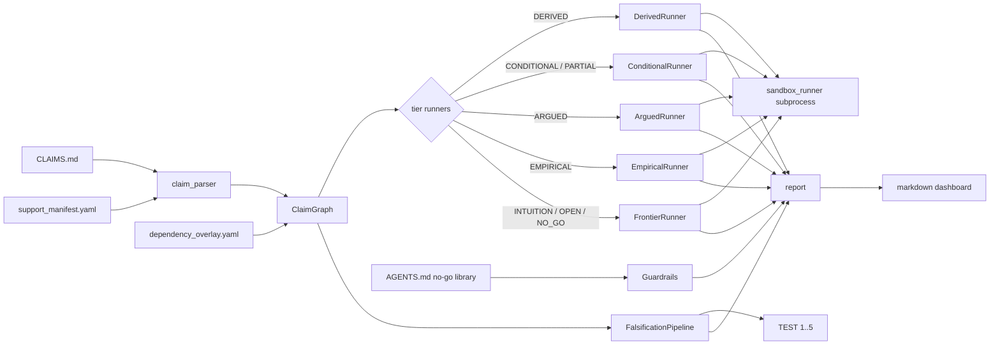

# Verification Harness

A read-only audit harness over `CLAIMS.md`. Parses the graded claim
taxonomy, runs tier-appropriate local verification for each row, wires
the five falsification tests, enforces the workspace guardrails, and
emits a markdown dashboard.

What it does **not** do:

- It does not mutate `CLAIMS.md`, `ACTIVE_ISSUES.md`, or
  `WHATS_NEXT.md`. The pipeline is read-only against every board
  document.
- It does not change confidence scores. Every confidence value on the
  dashboard is echoed verbatim from `CLAIMS.md`.
- It does not produce binary PASS/FAIL. Claim rows get one of six
  graded outcomes; falsification tests get one of four readouts.

## Architecture



ASCII fallback:

```
CLAIMS.md ──► claim_parser ──► ClaimGraph ──► tier runners ──┐
                                │                            ├──► report ──► dashboard
support_manifest.yaml ──────────┘                            │
dependency_overlay.yaml ───► ClaimGraph                      │
                        ───► FalsificationPipeline ──► TEST 1..5 ─┤
AGENTS.md ──► Guardrails (no-go library, truth order, protected files) ─┘
```

## Module overview

| Module | Purpose | Public entry |
| :--- | :--- | :--- |
| `verification.models` | Dataclasses and enums: `Claim`, `ClaimStatus`, `VerificationOutcome`, `VerificationResult`, `DependencyEdge` | — |
| `verification.claim_parser` | Parses `CLAIMS.md` into a dict of `Claim` records | `parse_claims_md(path, support_manifest=None)` |
| `verification.dependency_overlay` | Loads the YAML overlay; resolves short claim ids | `load_dependency_overlay(path, parsed_claims)`, `resolve_claim_id(ref, parsed_claims)` |
| `verification.support_manifest` | Loads the YAML manifest of audit-qualified derivation refs | `load_support_manifest(path, parsed_claims)` |
| `verification.claim_graph` | Builds the graph, topological order, cascade impact, validation | `ClaimGraph.from_markdown(...)` |
| `verification.runners.*` | Per-tier runner implementations | `get_runner_for_tier(status)` |
| `verification.sandbox_runner` | Subprocess wrapper for `sandbox/*.py` | `run_sandbox_script(path, seed=None)` |
| `verification.hypothesis_checker` | Closure detection for named hypotheses | `check_hypothesis_closure(hyp, files)` |
| `verification.falsification.pipeline` | Orchestrates the five falsification tests | `FalsificationPipeline().run_all(seed=None)` |
| `verification.falsification.models` | `FalsificationReadout`, `FalsificationTest` | — |
| `verification.guardrails` | Protected files, no-go library, truth order, score freeze | `Guardrails(...)`, `load_no_go_library(...)` |
| `verification.report` | Markdown dashboard + gap + cascade | `generate_dashboard`, `generate_gap_report`, `generate_cascade_report` |
| `verification.pipeline` | Main orchestrator and CLI | `run_verification_pipeline(...)` |

## Quickstart

```
python -m verification.pipeline --quick
```

The command parses the live `CLAIMS.md`, runs tier-appropriate
verification (skipping long-running Monte Carlo scripts in `--quick`
mode), runs the local falsification tests, and prints a markdown
dashboard to stdout. It never writes to any board document.

The dashboard has two tables:

1. Claim-level table: one row per claim with its CLAIMS.md status
   tier, graded outcome (`REPRODUCED`, `REGRESSION_OK`, `HYPOTHESIS_OPEN`,
   `SCRIPT_BROKEN`, `EXTERNAL_ONLY`, `UNDER_PRESSURE`), dependency
   state (`CLEAR`, `OPEN`, `UNDER_PRESSURE`, `NOT_DECLARED`), gap count,
   confidence (echoed from CLAIMS.md), and timestamp.
2. Falsification lane table: one row per TEST 1..5 with its readout
   (`PARTIAL_LOCAL`, `UNDER_PRESSURE`, `EXTERNAL_ONLY`, `SCRIPT_BROKEN`).

Read it as a snapshot. Rows marked `⚠` want attention; rows marked
`✓` are supportive; `○` is neutral / not-yet-resolvable locally.

## Tier to runner mapping

| Status tier | Runner | Possible outcomes |
| :--- | :--- | :--- |
| `DERIVED` | `DerivedRunner` | `REPRODUCED`, `REGRESSION_OK`, `SCRIPT_BROKEN`, `UNDER_PRESSURE`, `EXTERNAL_ONLY` |
| `CONDITIONAL`, `PARTIAL_DERIVATION` | `ConditionalRunner` | `HYPOTHESIS_OPEN`, `REGRESSION_OK`, `SCRIPT_BROKEN` |
| `ARGUED` | `ArguedRunner` | `UNDER_PRESSURE`, `REGRESSION_OK`, `SCRIPT_BROKEN`, `EXTERNAL_ONLY` |
| `EMPIRICAL` | `EmpiricalRunner` | `REPRODUCED`, `UNDER_PRESSURE`, `SCRIPT_BROKEN` |
| `INTUITION`, `OPEN`, `NO_GO` | `FrontierRunner` | `REGRESSION_OK`, `UNDER_PRESSURE`, `EXTERNAL_ONLY`, `SCRIPT_BROKEN` |

`SCRIPT_BROKEN` is always a tooling failure. It never counts as a
falsification or a score change.

## Graded outcomes

| Outcome | Meaning | Emitted when |
| :--- | :--- | :--- |
| `REPRODUCED` | The local harness directly reproduced the claim's core result | DERIVED / EMPIRICAL claim whose sandbox scripts all exit clean and numerical match lies within tolerance |
| `REGRESSION_OK` | Supporting regressions hold; no direct local reproduction available | DERIVED claim with audited derivation refs but no script; INTUITION/NO_GO claim whose exploratory check passes |
| `HYPOTHESIS_OPEN` | At least one named hypothesis is still unclosed | CONDITIONAL / PARTIAL_DERIVATION claim with an open `H_*` / `A_*` token |
| `SCRIPT_BROKEN` | The sandbox harness failed to execute | Subprocess traceback, missing dependency, timeout |
| `EXTERNAL_ONLY` | Only an external measurement can resolve this row | OPEN row with no local script; DERIVED row with no script and no audited ref; `--quick` skip |
| `UNDER_PRESSURE` | Local evidence contradicts the current claim framing | Sandbox result outside tolerance; ARGUED pressure test fires; NO_GO claim challenged |

## Falsification readouts

The falsification lane is separate from claim-level outcomes by design.

| Readout | Meaning |
| :--- | :--- |
| `PARTIAL_LOCAL` | A local harness ran cleanly and produced evidence consistent with the framework prediction, but local evidence alone cannot close the falsification criterion |
| `UNDER_PRESSURE` | A local harness ran cleanly and the numerical result tensions the framework prediction |
| `EXTERNAL_ONLY` | No local harness exists; the test depends on an external measurement. A non-discovery so far is explicitly not a pass |
| `SCRIPT_BROKEN` | The local harness failed to execute. Never a falsification — fix the harness and re-run |

## Configuration files

`verification/dependency_overlay.yaml` — explicit upstream/downstream
edges between claims. Edit when a new audited derivation makes a
dependency explicit. Never add claims here that are not in
`CLAIMS.md`; never add `status` or `confidence` keys. The overlay is
metadata, not a second scoreboard.

`verification/support_manifest.yaml` — marks which `derivations/*.md`
references already cited in `CLAIMS.md` are Codex-audited local
support. Edit when an audit closes. Same rule: never introduce new
claims or change statuses. Entries with non-existent file paths are
rejected at load.

## Guardrails

Enforced by `verification.guardrails.Guardrails`:

- Protected files: `CLAIMS.md`, `ACTIVE_ISSUES.md`, `WHATS_NEXT.md`
  are never written. Any modification detected by the enforcer is
  `BLOCK`.
- No-go library: loaded from `AGENTS.md` / `AGENTS_FULL.md` plus
  hardcoded fallback entries and `derivations/*_no_go*.md` filenames.
  Re-attempts of documented failures are `BLOCK`.
- Truth order: `sandbox/sandbox_results.md` > `CLAIMS.md` > `the_propagation_framework.md`.
  When a sandbox-negative result is paired with non-hedged framework
  framing, the enforcer emits `UNDER_PRESSURE` as a `WARN`.
- No-score-change: confidence scores before and after the run must
  match. Any drift is `BLOCK`.

## Caching

Sandbox script results are cached under `verification/.cache/` keyed
by the SHA-256 of the script file contents. The cache is gitignored.
A cache entry invalidates when:

- the script file is edited (content hash changes), or
- the cache file is deleted, or
- the cached result fails to deserialize.

The cache is an optimization, never a correctness requirement. A
missing or broken cache entry just re-runs the script.

## Testing

```
python -m pytest tests/unit -v
python -m pytest tests/integration -v
python -m pytest tests/ -v
```

Unit tests cover the parser, claim graph, runners, falsification
pipeline, guardrails, and report generator. Integration tests cover
the full pipeline against the real `CLAIMS.md`, consistency
invariants, determinism under a fixed seed, error handling, and
end-to-end requirement coverage.
